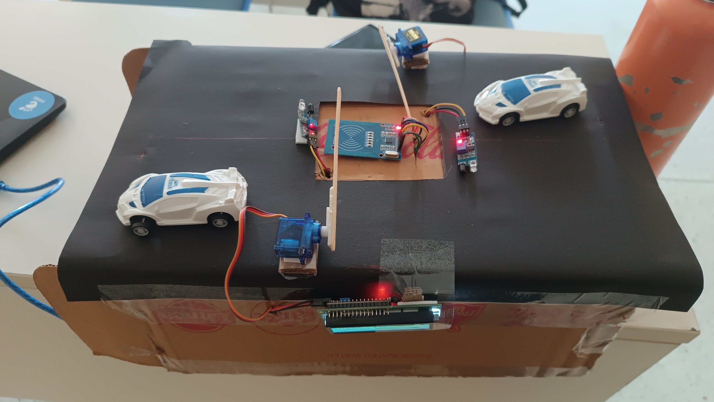

# Smart Parking System README

## Overview

The Smart Parking System is an IoT-based project designed for efficient parking management. It utilizes embedded C programming for Arduino and a Python server for communication. The system employs RFID technology, infrared sensors, and servo motors to automate entry and exit processes.



## Features

-   RFID card-based vehicle identification.
-   Infrared sensors for detecting vehicle presence.
-   Servo motors for automated entry and exit gates.
-   Arduino-based microcontroller for sensor interfacing.
-   Python server for communication and decision-making.

## Hardware Setup

### Arduino Connections

-   IR_LED_1: Pin 2
-   IR_LED_2: Pin 3
-   RFID Reset (RST_PIN): Pin 6
-   RFID SDA (SS_PIN): Pin 7
-   Servo Motor for IR_LED_1: Pin 9 (PB1)
-   Servo Motor for IR_LED_2: Pin 10 (PB2)

## Dependencies

-   [MFRC522 Library](https://github.com/miguelbalboa/rfid)
-   [LiquidCrystal_I2C Library](https://github.com/fdebrabander/Arduino-LiquidCrystal-I2C-library)

## Installation

1. Connect the hardware components as per the provided pin information.
2. Install the required libraries in the Arduino IDE.
3. Upload the provided Arduino sketch to the microcontroller.

## Server Setup

1. Ensure Python is installed on your system.
2. Modify the server.py file if necessary to match the correct Arduino port.
3. Run the server.py script.

## Code Details

### Interrupts and Interrupt Service Routines (ISRs)

The Smart Parking System utilizes interrupts to efficiently handle changes in the state of infrared sensors (IR_LED_1 and IR_LED_2). Interrupts are configured for both sensors, and corresponding Interrupt Service Routines (ISRs) are implemented.

#### ISR(INT0_vect) - Sensor 1 Interrupt

This ISR is triggered when a change in state is detected on IR_LED_1 (Pin 2). It handles the arrival and departure of vehicles at the entry point.

```c
ISR(INT0_vect)
{
    // ... (implementation)
}
```

#### ISR(INT1_vect) - Sensor 2 Interrupt

This ISR is triggered when a change in state is detected on IR_LED_2 (Pin 3). It handles the arrival and departure of vehicles at the exit point.

```c
ISR(INT1_vect)
{
    // ... (implementation)
}
```

### Delay Function

The `delay_ms` function is a custom delay function that provides delay in milliseconds without using the built-in `delay` function.

```c
void delay_ms(int ms)
{
    // ... (implementation)
}
```

Feel free to explore and modify the code as needed, and use this README as a comprehensive guide to understanding and working with the Smart Parking System.

## Troubleshooting

-   Ensure proper connections and power supply for the Arduino.
-   Check serial communication between the Arduino and the server.
-   Verify RFID card functionality.

## Contributing

Contributions to the project are welcome. Please follow the coding guidelines and create a pull request.
